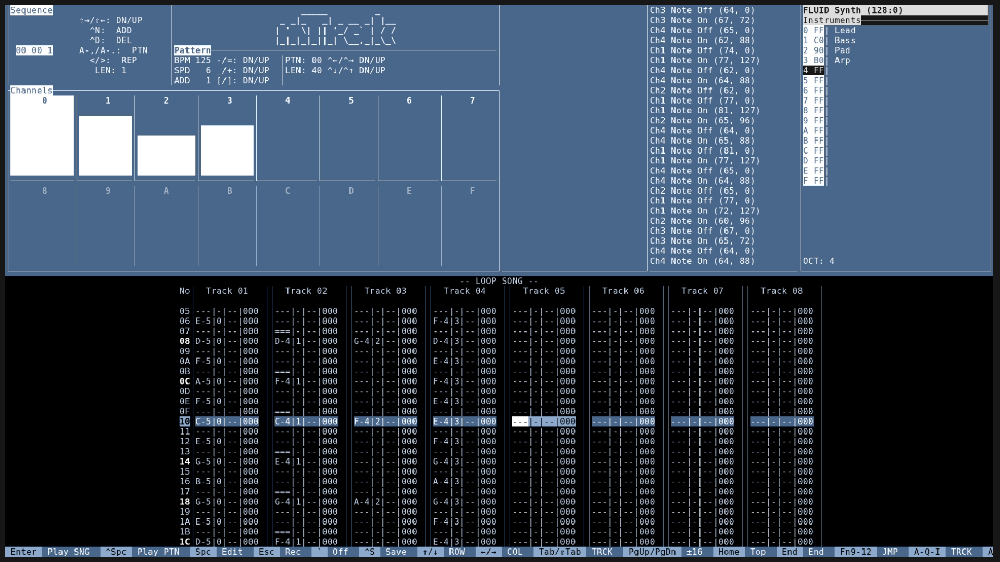

# mTrak

A lightweight MIDI tracker for the terminal.

mTrak is modelled on FastTracker 2: the same pattern editor layout, piano keyboard
mapping and navigation keys. Instead of playing samples it sends MIDI, so it can drive
any hardware or software synth.



## Features

- Windows, Mac and Linux
- Full TUI with total keyboard control
- Pattern editor with 8 tracks per pattern, FT2-style keyboard note entry and navigation
- Song sequence with per-pattern repeats
- MIDI output on all 16 channels, with one instrument per channel and a per-instrument volume
- Command column for (midi) effects, CC, CC slides, velocity slides, aftertouch and pitch bend
  (see [docs/COMMANDS.md](docs/COMMANDS.md))
- Pattern and song playback, looping or once through for recording
- Per-channel activity meters, channel muting and a MIDI event monitor
- Context-aware key hints in the footer
- FT2 color theme on truecolor terminals, with a monochrome fallback

## Installation

### From a release

Download the binary for your platform from the
[releases page](https://github.com/TheExiledCat/mTrak/releases) and put it somewhere on
your `PATH`.

### From source

You need a recent stable Rust toolchain (install it with [rustup](https://rustup.rs)).
On Linux you also need the ALSA development headers, e.g. `libasound2-dev` on
Debian/Ubuntu or `alsa-lib-devel` on Fedora.

```sh
cargo install --git https://github.com/TheExiledCat/mTrak
```

Or from a local clone:

```sh
git clone https://github.com/TheExiledCat/mTrak
cd mTrak
cargo install --path .
```

## Usage

```sh
mtrak                  # start with an empty project
mtrak song.mtrak       # open a project
```

Pick a MIDI output port with `Ctrl+O`. mTrak makes no sound on its own, so connect it to
a synth such as FluidSynth or a DAW.

## Contributing

Bug reports, feature requests and pull requests are welcome. See
[CONTRIBUTING.md](CONTRIBUTING.md).
